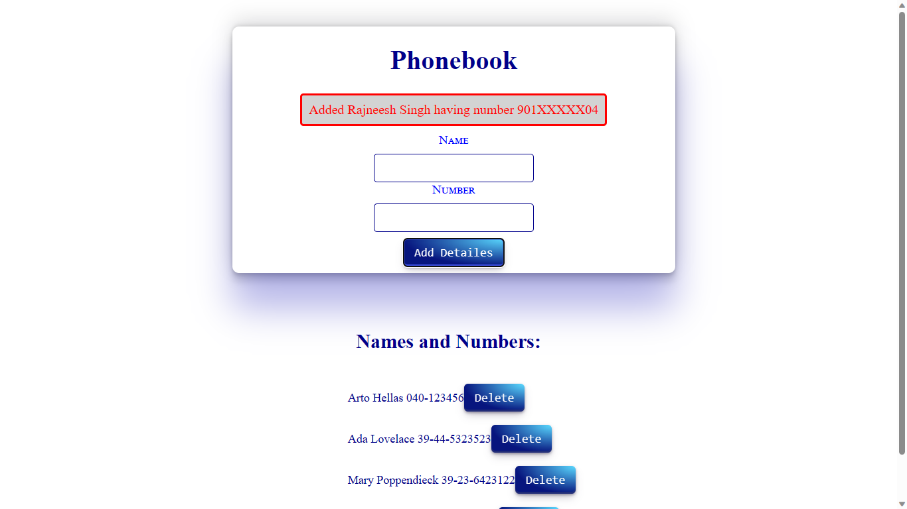
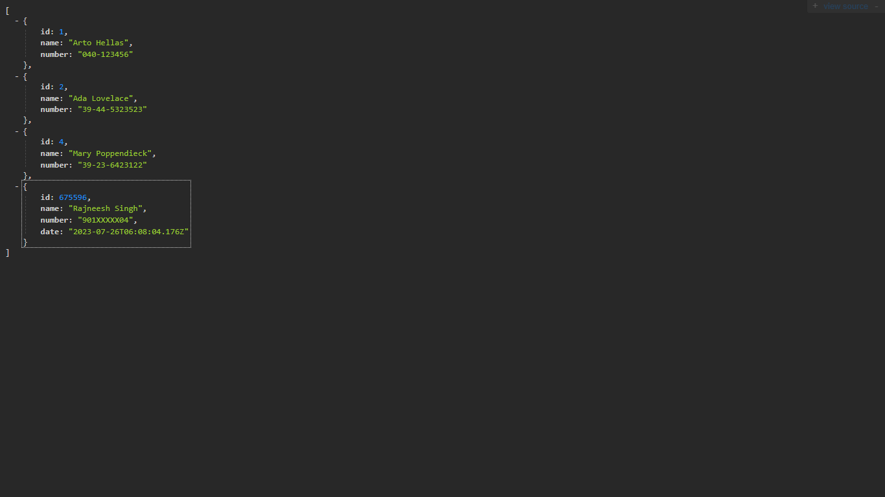

# PhoneBook :  nodeJs & express  , and render for deploymnet

## Live Demo For Frontend Part : <a href="https://phonebook-complete.onrender.com/">Live Demo</a> 
## To see Data Submited by You  :  <a href="https://phonebook-complete.onrender.com/api/persons">Click Here</a> 

### Note : Sometime request and response take time in render .

## Nodemon --> nodemon is a tool that helps develop Node.js based applications by automatically restarting

## Express --> Express.js is a web framework for Node.js that provides a minimal and flexible way to create web and mobile applications, APIs, and dynamic HTTP objects

                 "dependencies": {
                    "cors": "^2.8.5",
                    "express": "^4.18.2",
                    "morgan": "^1.10.0"
                  },
                 "devDependencies": {
                    "nodemon": "^3.0.1"
                  }

                Step1  : npm run dev
                step 2 : npm install cors

-->Copy and paste in index.js in backend part :

                const cors = require('cors')
                app.use(cors())

-->port our application uses at the bottom of the index.js file like so:

                const PORT = process.env.PORT || 3003
                app.listen(PORT, () => {
                console.log(`Server running on port ${PORT}`)
                })

##  Frontend production build

                step 1 : npm run build

-->Because of our situation, both the frontend and the backend are at the same address, we can declare baseUrl as a relative URL

                import axios from 'axios'

                <b>const baseUrl = '/api/persons'</b>

                const getAll = () => {
                const request = axios.get(baseUrl)
                return request.then(response => response.data)
                }

                // ...

# Serving static files from the backend

### To make express show static content, the page index.html and the JavaScript, etc., it fetches, we need a built-in middleware from express called static.

                    app.use(express.static('build'))

                    npm install mongoose

## setup mongo.js file 

# Connecting the backend to a database
